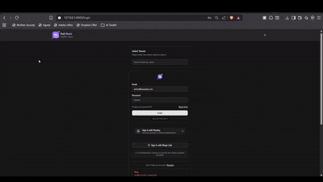
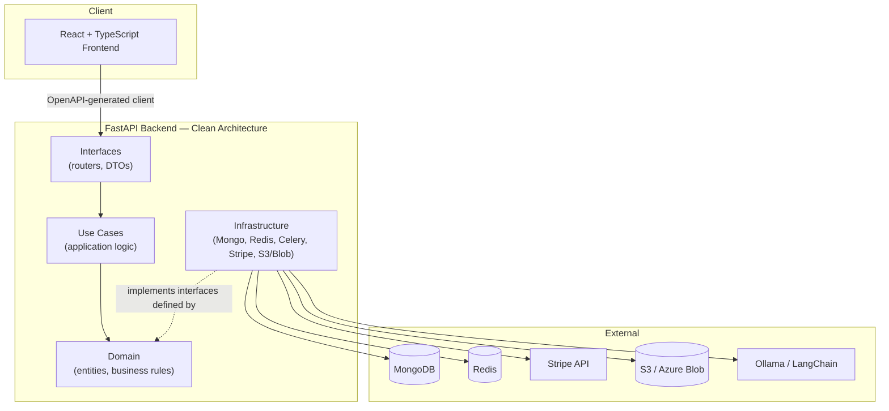

<div align="center">

# Full-Stack Project


A production-oriented, multi-tenant SaaS starter built on **Clean Architecture** — FastAPI + MongoDB on the backend, React + TypeScript on the frontend, with tenant isolation, RBAC, Stripe billing, and async workflows baked in from day one.

</div>

---

## Demo

<p align="center">
  
</p>

> **Application Demo:** Authentication, user management, role-based access control, tenant management, and a responsive frontend interacting live with the FastAPI backend.

---

## Features

### 🔐 User Management
- JWT authentication with refresh tokens
- Self-registration with email verification
- Profile management with image upload
- Passkeys (WebAuthn) and Magic Link (passwordless) login
- Configurable SSO

### 🏢 Tenant Management
- Isolated data per tenant, resolved per-request
- Tenant search by name and subdomain
- Subdomain routing + bring-your-own-domain support
- Full tenant admin (create, update, configure)

### 👥 Role Management (RBAC)
- Dynamic, tenant-scoped roles
- Granular permission matrix
- Role assignment within tenant context

### ☁️ Cloud Storage
- Azure Blob Storage and AWS S3, interchangeable via config
- Validated, secure file upload pipeline

### 🤖 AI Chat
- Local model inference via Ollama
- Real-time streaming responses
- Persistent chat history, runtime model switching

### 💳 Stripe Billing
- Product & plan CRUD, monthly/yearly intervals
- Configurable trial periods
- Multi-currency support
- Webhook-driven invoice and checkout-session tracking

### 🎛️ Feature Management
- Per-tenant feature toggles, real-time activation

---

## Architecture

Backend follows Clean Architecture — dependencies point inward, infrastructure implements interfaces defined by the layers above it.



---

## Tech Stack

**Backend:** FastAPI · MongoDB (Beanie ODM) · Redis · Celery · JWT · LangChain
**Frontend:** React 18 · TypeScript · Vite · Tailwind CSS · shadcn/ui · React Hook Form
**Infrastructure:** Docker · Docker Compose · Helm (Kubernetes) · Coolify

---

## Project Structure

```
full_stack_fastapi_react_template/
├── backend/
│   ├── api/
│   │   ├── common/            # Shared utilities and constants
│   │   ├── core/               # Core business logic
│   │   ├── domain/             # Entities, DTOs, business rules
│   │   ├── infrastructure/     # MongoDB, Redis, Stripe, storage
│   │   ├── interfaces/         # Routers / controllers
│   │   └── usecases/           # Application use cases
│   ├── tests/
│   ├── pyproject.toml
│   └── Dockerfile
├── frontend/app/
│   └── src/
│       ├── api/                # Auto-generated OpenAPI client
│       ├── components/
│       │   ├── features/       # Auth, billing, tenant, chat
│       │   ├── layouts/
│       │   ├── providers/
│       │   ├── shared/
│       │   └── ui/             # shadcn/ui primitives
│       └── hooks/
├── infra/helm/                 # Kubernetes deployment charts
└── dev.compose.yaml
```

---

## Getting Started

### Prerequisites
- Python 3.13+
- Node.js 22+
- Docker & Docker Compose
- pnpm (recommended) or npm

### Setup

```bash
git clone https://github.com/sajanv88/full_stack_fastapi_react_template.git
cd full_stack_fastapi_react_template

cp backend/.env.example backend/.env   # then fill in your own values

docker-compose -f dev.compose.yaml up -d   # MongoDB, Redis, fake SMTP, Caddy
```

### Backend

```bash
cd backend
uv sync
uv run fastapi dev api
```

### Frontend

```bash
cd frontend/app
pnpm install
pnpm dev
```

| Service | URL |
|---|---|
| Backend API | http://localhost:8000 |
| API Docs | http://localhost:8000/docs |
| Frontend | http://localhost:5173 |
| MongoDB | localhost:27012 |
| Redis | localhost:6372 |
| Fake SMTP UI | http://localhost:1083 |

---

## Testing

✅ **23 automated tests** · ✅ **Ruff linting** · ✅ **GitHub Actions CI**

Tests run against a real, isolated MongoDB instance rather than mocks, so infrastructure needs to be up first.

**1. Start infrastructure** (from the project root):

```bash
docker-compose -f dev.compose.yaml up -d
```

This brings up `mongodatabase` (MongoDB, mapped to `27012:27017`), `redis`, `caddy`, and `fake_smtp`. Confirm with `docker ps`.

**2. Install dependencies and run** (from `backend/`):

```bash
uv sync
uv run pytest -v
```

Expected result:

```
collected 23 items
tests\interfaces\test_role_endpoint.py ........  [ 34%]
tests\interfaces\test_tenant_endpoint.py ....... [ 65%]
.                                                [ 69%]
tests\interfaces\test_user_endpoint.py .......   [100%]
================= 23 passed in 5.40s ==================
```

**Notes:**
- `tests/conftest.py` points at a dedicated `test_db` on the same MongoDB container used for development — dev data is never touched.
- `pytest-asyncio` runs in **auto mode** (`asyncio_mode = "auto"` in `pyproject.toml`), so async fixtures and tests work without per-test `@pytest.mark.asyncio` decorators.
- The authenticated user is mocked via a `get_current_user` dependency override, so protected endpoints can be tested without a real login flow.
- Each test gets its own isolated database per function — keep the `mongodb` container running between test runs rather than restarting it each time.

Other useful commands:

```bash
uv run pytest tests/interfaces/    # run only interface/API tests
uv run pytest -k test_name         # run a single test
uv run ruff check .                # lint
```

---

## Contributing

1. Follow the established Clean Architecture folder structure
2. Use TypeScript for all frontend code
3. Add tests for new features — CI will run them automatically
4. Regenerate the frontend API client after backend changes: `pnpm run generate:api`

---
